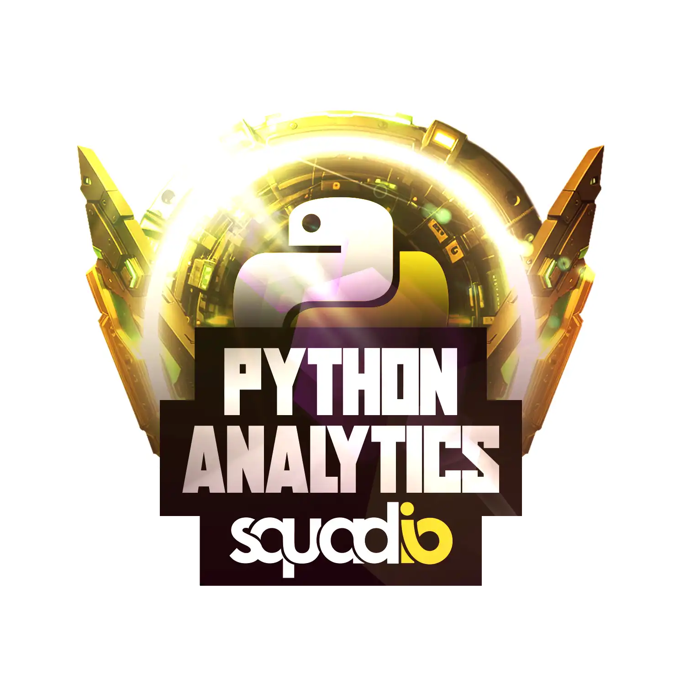
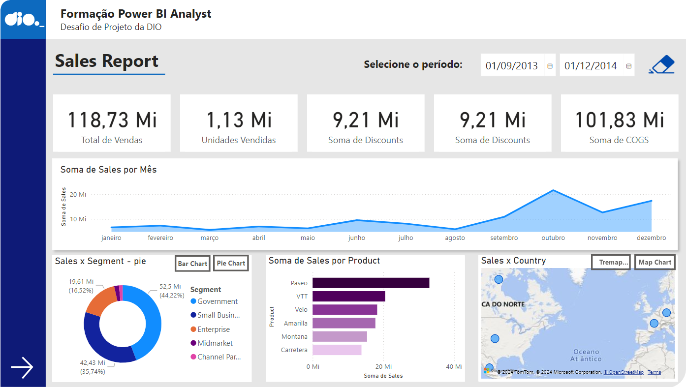
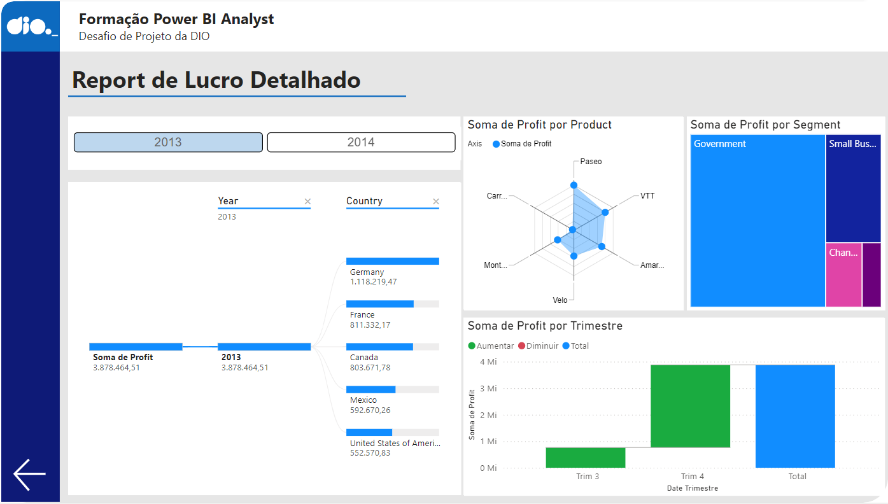

# DIO-Python-Data-Analytics 

Bootcamp Coding The Future Squadio - Python Data Analytics: processo de instalação, conceitos de funções Python e os seus principais comandos, noções importantes de base de dados relacionais e não relacionais (SQL e noSQL).

# Desafio Projeto: Criando um Relatório de Vendas Elegante com Power BI

